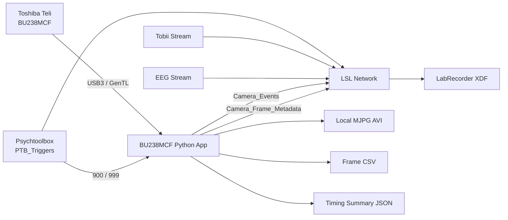

# Toshiba Teli BU238MCF - Minimal 30 FPS LSL USB3 Camera Project for Material Perception EEG Experiment

A minimal camera recorder for the **Toshiba Teli BU238MCF** used in a multimodal EEG experiment. It saves a local 30 FPS MJPG video, streams camera frame IDs and host-delivery timestamps through LSL, detects missing camera BlockIDs, and supports either manual control or Psychtoolbox triggers `900` and `999`.

## Why 30 FPS?

The previous 60 FPS full-resolution recording overloaded the writer pipeline and produced missing BlockIDs and a full writer queue. The 30 FPS version halves the acquisition and encoding load while remaining suitable for monitoring the participant, number-pad responses, and experiment screen.

## Project Files

```text
BU238MCF_LSL_30FPS_Minimal_Project/
├── bu238mcf_lsl_30fps.py
├── camera_settings.json
├── run_manual_30fps.bat
├── run_ptb_30fps.bat
├── requirements.txt
├── README.md
└── Camera_Recordings/
```

Only edit `camera_settings.json`. Both BAT files use the same fixed camera parameters.

---

## Experimental Architecture



---

## Default Fixed Camera Settings (Adjusted Manually by TeliViewer)
```json
{
  "cti_path": "C:\\Program Files\\TOSHIBA TELI\\TeliCamSDK\\TeliCamApi\\bin\\x64\\TeliCamTL64.cti",
  "output_dir": "Camera_Recordings",
  "serial": "1205610",
  "exposure_us": 5000,
  "gain_db": 16.00,
  "gamma": 0.80,
  "black_level": 0.0,
  "balance_red": 2.70,
  "balance_blue": 2.30,
  "pixel_format": "BayerBG8",
  "warmup_seconds": 2.0,
  "post_stop_seconds": 2.0,
  "discard_frames_after_start": 1,
  "camera_buffers": 128,
  "writer_queue_frames": 120,
  "preview_every": 2,
  "progress_every_frames": 300,
  "fetch_timeout_seconds": 1.0,
  "video_codec": "MJPG",
  "ptb_stream_name": "PTB_Triggers",
  "ptb_start_code": "900",
  "ptb_stop_code": "999"

  def raw_to_bgr(raw: np.ndarray, fmt: str) -> np.ndarray:
    conversions = {
        "Mono8": cv2.COLOR_GRAY2BGR,
        "BayerBG8": cv2.COLOR_BAYER_RG2BGR,
        "BayerGB8": cv2.COLOR_BAYER_GR2BGR,
        "BayerGR8": cv2.COLOR_BAYER_GB2BGR,
        "BayerRG8": cv2.COLOR_BAYER_BG2BGR,
    }
}
```

The red and blue values are the one-push values reported by your camera in the current room. They are useful starting values under the same lighting.

The project fixes:

- resolution: `1920 × 1200`
- frame rate: `30 FPS`
- acquisition mode: continuous
- trigger mode: off
- white balance: manual/fixed
- video format: MJPG AVI

### Parameter Guidance

| Parameter | Default | Adjustment |
|---|---:|---|
| Exposure | 5000 µs | Increase toward 18000–22000 if dark; reduce toward 10000–12000 if hand motion blurs or the monitor clips |
| Gain | 16 dB | Increase only after improving lighting/opening the lens; 16 dB is a reasonable next test |
| Gamma | 0.80 | Neutral tonal response; keep fixed unless you have a documented reason |
| Black level | 0 | Keep at zero for normal use |
| Red WB | 2.7 | Replace with a manually chosen TeliViewer value if lighting changes |
| Blue WB | 2.3 | Replace with a manually chosen TeliViewer value if lighting changes |

Use stable, flicker-free room lighting. Open the lens aperture before raising gain. The monitor and hand should both be visible without clipping or strong shadow.

## Installation

Install the Toshiba TeliCamSDK and verify the camera in TeliViewer. Close TeliViewer before running Python (V3.12 is also ok).

Create a Python environment:

```powershell
py -3.11 -m venv .venv
.\.venv\Scripts\python.exe -m pip install --upgrade pip
.\.venv\Scripts\python.exe -m pip install -r requirements.txt
```

Check `camera_settings.json`:

- `cti_path` must point to `TeliCamTL64.cti`
- `serial` should match your camera
- `output_dir` may remain `Camera_Recordings`

## Manual Recording

Run:

```text
run_manual_30fps.bat
```

Workflow:

1. Enter the subject ID.
2. Camera and LSL streams start.
3. Start LabRecorder.
4. Press Enter to begin local recording.
5. Press Enter again to stop.
6. Wait for the AVI and logs to close.

Manual mode includes a reduced preview. Close TeliViewer before using it.

## PTB-Controlled Recording

Run:

```text
run_ptb_30fps.bat
```

Workflow:

1. Enter the subject ID.
2. Start EEG and Tobii outlets.
3. Run the camera BAT.
4. Run the MATLAB/PTB experiment.
5. Confirm all streams appear in LabRecorder.
6. Start LabRecorder.
7. PTB trigger `900` starts camera recording.
8. PTB trigger `999` requests stop.
9. The camera records the configured 2-second post-buffer.
10. Wait for camera finalization.
11. Stop LabRecorder last.

The PTB mode matches the experiment's `PTB_Triggers` stream and `900`/`999` session markers.

## LSL streams

### `Camera_Frame_Metadata`

Three numeric channels at 30 samples/s:

| Channel | Meaning |
|---|---|
| `frame_id` | Camera/GenTL BlockID |
| `video_frame_index` | Matching frame number in the AVI |
| `dropped_frame_total` | Cumulative missing BlockIDs |

The XDF timestamp associated with every sample is the camera-PC LSL time measured immediately after the completed frame reaches Python. Use the synchronized XDF timestamp for software alignment with EEG, PTB, and Tobii.

### `Camera_Events`

Essential markers only:

```text
CAMERA_STREAM_READY
CAMERA_ACQUISITION_RUNNING
RECORDING_STARTED
FIRST_FRAME
FRAME_DROP
STOP_REQUEST_RECEIVED
CAMERA_RECORDING_STOPPED
```

## Local Outputs

```text
Camera_Recordings/
├── S01_YYYYMMDD_HHMMSS_ptb_camera_30fps.avi
├── S01_YYYYMMDD_HHMMSS_ptb_camera_frames.csv
└── S01_YYYYMMDD_HHMMSS_ptb_camera_summary.json
```

The CSV stores:

```text
frame_id
video_frame_index
host_lsl_timestamp_s
host_interframe_ms
dropped_this_frame
dropped_frame_total
```

## Minimal Command-Window Output

During a normal recording, the important lines are:

```text
[READY] LSL streams: Camera_Frame_Metadata, Camera_Events
[READY] Warm-up complete
[START] Trigger 900 received
[RECORDING] Started
[START DELAY] PTB 900 -> first frame
[RUN] frames=... | FPS=... | drops=... | queue=...
[STOP] Trigger 999 received
[COMPLETE] frames written, drops, file paths
```

## Acceptance Checks

A clean run should show:

```text
effective FPS close to 30
camera frame drops = 0
video frames received = video frames written
writer queue remains well below its maximum
```

The expected frame interval is approximately:

```text
33.333 ms
```

## Timing Interpretation

The difference between PTB trigger `900` and the first camera metadata timestamp is:

> PTB-900-to-first-completed-frame-delivery latency.

It is valid for software alignment after XDF clock synchronization. It is not the camera's physical exposure-onset time. For physical timing, record the camera `ExposureActive` GPIO through an electrically isolated EEG AUX or digital input.
