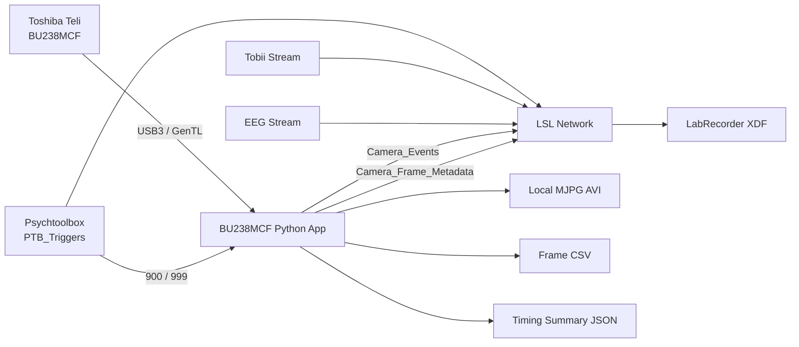

# Toshiba Teli BU238MCF — 60 FPS LSL Camera Recorder for EEG

Real-time experiment-video recording and frame-metadata streaming for the **Toshiba Teli BU238MCF** industrial camera. The project is designed for multimodal EEG studies using **Lab Streaming Layer (LSL)**, **Psychtoolbox (PTB)**, **LabRecorder**, EEG, eye tracking, and synchronized experiment video.

> **Repository description (350 characters)**  
> Real-time 60 FPS recording and LSL synchronization for the Toshiba Teli BU238MCF in EEG experiments. Captures camera BlockIDs and timestamps, detects dropped frames, saves MJPG video/CSV/JSON, responds to PTB triggers 900/999, reports startup and shutdown latency, and supports calibrated or fixed white balance. For multimodal EEG quality assurance.

---

## Overview

The camera application:

- acquires **1920 × 1200 Bayer color frames at 60 FPS**;
- starts the camera pipeline before the experimental session to reduce startup delay;
- waits for PTB trigger **`900`** to begin saving frames;
- receives PTB trigger **`999`** to stop after a configurable post-session buffer;
- saves the video locally as **MJPG AVI**;
- saves one CSV row per recorded frame;
- publishes compact frame metadata through LSL;
- uses the camera/GenTL **BlockID** as the frame number;
- detects missing BlockIDs and reports dropped frames;
- prints step-by-step startup, delivery, and shutdown timing;
- saves a JSON summary of camera settings and timing results.

The full video is intentionally saved locally rather than written into XDF. Only compact frame metadata and camera events are streamed through LSL.

---

## Experimental architecture



---

## Project files

```text
BU238MCF_LSL_60FPS_DelayQC_Project/
├── toshiba_teli_camera_lsl_60fps.py
├── requirements.txt
├── run_calibrate_BU238MCF_60fps.bat
├── run_ptb_BU238MCF_60fps_AutoWB.bat
├── run_ptb_BU238MCF_60fps_FixedWB.bat
├── README.md
└── Camera_Recordings/
```

### Main files

| File | Purpose |
|---|---|
| `toshiba_teli_camera_lsl_60fps.py` | Camera acquisition, local video recording, LSL streaming, frame-loss detection, and timing diagnostics |
| `run_calibrate_BU238MCF_60fps.bat` | Manual preview and one-push white-balance calibration |
| `run_ptb_BU238MCF_60fps_AutoWB.bat` | PTB-controlled recording with one-push white balance at startup |
| `run_ptb_BU238MCF_60fps_FixedWB.bat` | PTB-controlled recording using fixed calibrated red/blue balance ratios |
| `requirements.txt` | Python dependencies |
| `Camera_Recordings/` | AVI, frame CSV, and JSON output |

---

## Hardware and software requirements

### Hardware

- Toshiba Teli **BU238MCF**
- Compatible C-mount lens
- USB3 SuperSpeed cable and dedicated USB3 port
- Stable camera mount
- Flicker-free, high-CRI lighting
- Computer with adequate CPU, RAM, and disk speed

### Vendor software

Install separately:

- Toshiba **TeliCamSDK**
- Toshiba USB3 Vision driver
- TeliViewer
- Toshiba 64-bit GenTL `.cti` producer

### Python

Recommended:

```text
64-bit CPython 3.11
Windows 10 or Windows 11
```

Python packages:

```text
harvesters==1.4.3
genicam==1.5.1
numpy>=1.26.4,<2.4
opencv-python>=4.10,<5
pylsl==1.18.2
```

---

## Installation

### 1. Verify the camera in TeliViewer

Before using Python:

1. Connect the BU238MCF through USB3.
2. Open TeliViewer.
3. Confirm that a live image is visible.
4. Check exposure, gain, pixel format, frame rate, and focus.
5. Close TeliViewer before launching the Python application.

Only one application should control the camera at a time.

### 2. Create the virtual environment

Open PowerShell in the project folder:

```powershell
py -3.11 -m venv .venv
.\.venv\Scripts\python.exe -m pip install --upgrade pip setuptools wheel
.\.venv\Scripts\python.exe -m pip install -r requirements.txt
```

Verify:

```powershell
.\.venv\Scripts\python.exe -c "import cv2, numpy, pylsl; from harvesters.core import Harvester; print('Dependencies OK')"
```

### 3. Find the Toshiba GenTL producer

Search for the installed `.cti` file:

```powershell
Get-ChildItem "C:\Program Files" -Filter *.cti -Recurse -ErrorAction SilentlyContinue |
    Select-Object FullName
```

Copy the full path and set it as `CTI_PATH` in each BAT file.

Example only:

```bat
set "CTI_PATH=C:\Program Files\TOSHIBA TELI\TeliCamSDK\GenTL\x64\TeliU3vGenTL.cti"
```

---

## Recommended 60 FPS camera profile

The supplied launch files use the following starting values:

| Parameter | Starting value |
|---|---:|
| Resolution | 1920 × 1200 |
| Frame rate | 60 FPS |
| Pixel format | BayerBG8 |
| Exposure | 8333 µs |
| Gain | 3 dB |
| Gamma | 1.0 |
| Black level | 0 |
| Video codec | MJPG AVI |
| Camera buffers | 128 |
| Writer queue | 120 frames |

These values are a starting point, not a universal optimum.

For clear hand and number-pad motion:

- use stable, flicker-free illumination;
- open the lens aperture before substantially increasing gain;
- keep exposure near **6–10 ms** when motion sharpness is important;
- increase illumination before increasing gain;
- use fixed camera and lighting settings for all participants.

If the image is still dark:

1. improve room/key lighting;
2. open the lens aperture;
3. increase gain from 3 dB to 6 dB;
4. increase exposure carefully while confirming that effective frame rate remains 60 FPS.

---

## White-balance calibration

### Calibration run

Edit `CTI_PATH`, then run:

```text
run_calibrate_BU238MCF_60fps.bat
```

Place a neutral white or gray card in the participant region during startup. The command window will print calibrated values such as:

```text
Red=1.42
Blue=1.76
```

### Fixed white balance

Open:

```text
run_ptb_BU238MCF_60fps_FixedWB.bat
```

Replace:

```bat
set "WB_RED=SET_ME"
set "WB_BLUE=SET_ME"
```

with the calibration values:

```bat
set "WB_RED=1.42"
set "WB_BLUE=1.76"
```

Fixed white balance is recommended when the room lighting remains unchanged and consistent color is required across participants.

---

## LSL streams

### `Camera_Frame_Metadata`

Regular numeric stream at nominally 60 samples/s.

| Channel | Meaning |
|---|---|
| `frame_id` | Camera/GenTL BlockID |
| `video_frame_index` | One-based frame index in the local AVI |
| `camera_timestamp_s` | Timestamp in the camera/GenTL clock domain |
| `dropped_frame_total` | Cumulative number of missing BlockIDs |

The **XDF timestamp** of each metadata sample is the camera-PC LSL time taken immediately after the completed frame buffer reaches Python. It is the timestamp used for software alignment with EEG, PTB, and Tobii after XDF synchronization.

The camera timestamp is retained for frame-interval and drift analysis. Do not directly subtract it from a timestamp belonging to another LSL stream.

### `Camera_Events`

Irregular string marker stream containing essential events:

```text
CAMERA_STREAM_READY
CAMERA_ACQUISITION_RUNNING
CAMERA_WAITING_FOR_PTB_900
PTB_900_RECEIVED_BY_CAMERA_APP
RECORDING_GATE_OPEN
FIRST_RECORDED_FRAME_RECEIVED
FIRST_RECORDED_FRAME_WRITTEN
FRAME_DROP
PTB_999_RECEIVED_BY_CAMERA_APP
CAMERA_RECORDING_STOPPED
```

---

## PTB-controlled recording

The program listens to the existing LSL stream:

```text
PTB_Triggers
```

Default control codes:

| Trigger | Action |
|---:|---|
| `900` | Open the local camera recording gate |
| `999` | Start the post-session buffer and stop cleanly |

The camera pipeline begins before `900`, fetches and discards warm-up frames, and remains ready. This reduces the delay between trigger `900` and the first recorded frame.

### Recommended startup order

1. Start EEG LSL outlet.
2. Start Tobii LSL outlet.
3. Run the camera BAT file.
4. Run the PTB experiment.
5. Confirm `PTB_Triggers`, camera, EEG, and Tobii streams are visible.
6. Start LabRecorder.
7. Press the PTB start key.
8. PTB sends `900`; the camera begins saving frames.
9. PTB sends `999`; the camera records the post-session buffer.
10. Wait until the camera files are finalized.
11. Stop LabRecorder last.

---

## Step-by-step delay diagnostics

The command window reports:

1. PTB source timestamp;
2. LSL inlet time correction;
3. PTB timestamp mapped into the camera-PC LSL clock;
4. camera application marker-receive time;
5. estimated LSL delivery/scheduling delay;
6. recording-gate opening time;
7. first recorded frame delivery time;
8. first frame enqueue time;
9. first frame AVI-write time;
10. camera stop and video-finalization timing.

Example:

```text
[START DELAY SUMMARY]
900 -> camera app receive            : 0.781 ms
900 -> recording gate open           : 0.931 ms
900 -> first recorded frame received : 33.601 ms
900 -> first frame enqueued           : 34.801 ms
Gate -> first recorded frame received: 32.670 ms
First frame receive -> AVI write      : 5.340 ms
900 -> first frame actually written   : 38.941 ms
```

The JSON summary preserves these values for later quality control.

---

## Output files

Each recording creates:

```text
Camera_Recordings/
├── S01_YYYYMMDD_HHMMSS_camera_60fps.avi
├── S01_YYYYMMDD_HHMMSS_camera_frames.csv
└── S01_YYYYMMDD_HHMMSS_camera_summary.json
```

### Frame CSV columns

```text
frame_id
video_frame_index
camera_timestamp_s
host_lsl_timestamp_s
camera_interframe_ms
host_interframe_ms
dropped_this_frame
dropped_frame_total
```

### Quality criteria

A clean run should satisfy:

```text
camera_dropped_total = 0
video_frames_received = video_frames_written
camera inter-frame interval ≈ 16.667 ms
no FRAME_DROP event
no camera fetch timeout
```

---

## Timing interpretation and limitation

The difference:

```text
first Camera_Frame_Metadata XDF timestamp − PTB trigger 900 timestamp
```

measures:

> PTB-900-to-first-completed-frame-delivery latency.

It includes LSL reception, recording-gate processing, camera frame phase, sensor readout, USB transfer, and host buffer delivery. It is useful and valid as a software end-to-end timing measure.

It is **not** a direct physical exposure-onset measurement.

For physical timing validation:

- use a screen photodiode to measure actual stimulus luminance onset;
- configure the camera GPIO as `ExposureActive`;
- route the camera exposure signal through an electrically isolated EEG AUX or digital input.

---

## Troubleshooting

### Camera is not detected

- close TeliViewer;
- confirm the camera works in TeliViewer first;
- verify the `.cti` path;
- use 64-bit Python with a 64-bit GenTL producer;
- connect directly to a USB3 port;
- avoid low-quality USB hubs.

### Image is too dark

- improve room lighting;
- open the lens aperture;
- increase exposure moderately;
- increase gain only after lighting/exposure;
- verify that the Python command is not overriding the preferred TeliViewer values.

### Colors are incorrect

Confirm the exact Bayer pixel format in TeliViewer. Replace `BayerBG8` with the reported format if necessary.

### Frames are dropped

- lower the frame rate temporarily;
- disable preview during the real experiment;
- use a dedicated USB3 controller;
- use a faster local disk;
- avoid writing into OneDrive or another live-synchronized folder;
- increase lighting rather than using long exposure;
- review `frame_id`, `camera_interframe_ms`, and `dropped_frame_total`.

### Camera does not stop after `999`

Confirm:

- PTB sends exactly `999`;
- the BAT file uses `--ptb-stop-code 999`;
- the camera console prints `PTB_999_RECEIVED_BY_CAMERA_APP`;
- the program is allowed to finish its post-session buffer and close the AVI.

---

## Research-use note

This project is intended for research instrumentation and quality-control workflows. Camera timing should be validated in the final hardware configuration before collecting experimental data. The software metadata does not replace hardware verification of monitor onset or camera exposure.

---

## License

Add the license selected by your laboratory or institution before publishing the repository.
